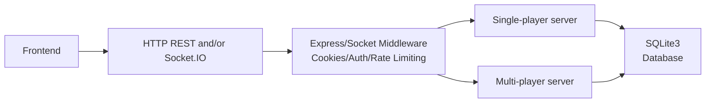

<div align='center'>

# <span style='color: rgb(0, 255, 255)'>🧊🔨ICE</span><span style='color: rgb(255, 45, 120)'>Breaker🧊🔨</span>


&emsp;
&emsp;
&emsp;
&emsp;


---


######


---


######


#####

#####

</div>

#
---
# Table of Contents
---
- [Introduction](#introduction)
- [Usage/Installation](#usage)
    + └─ [Usage](#usage)
    + └─ [Installation](#first-time-installation)
- [Architecture/Routes](#architecture)
    + └─ [Architecture](#architecture)
    + └─ [Routes](#routes)
- [Features/Mechanics](#features)
- [Planned Features (not yet active)](#planned-features-not-yet-active)
#
#
# Introduction

ICEbreaker is a browser-based single-player hacking minigame inspired by the
Cyberpunk 2077 "Breach Protocol" mechanic. Players are presented with a 7x7
matrix of 2-character hex codes and must select a sequence of cells following
alternating row/column constraints, with the goal of matching as many "daemon" solution
sequences as possible before a countdown timer expires. The GUI aesthetic is cyberpunk with
neon green/red terminal effects.

---
# Usage

### First-Time Installation

#### Environment Dependencies:
- Node (required)
- homebrew (optional, for installing node if node is not already installed)


install homebrew(optional for installing node)
```bash
/bin/bash -c "$(curl -fsSL https://raw.githubusercontent.com/Homebrew/install/HEAD/install.sh)";
#installs homebrew

echo 'eval "$(/opt/homebrew/bin/brew shellenv)"' >> ~/.zprofile;
#adds homebrew to your zsh profiles;

eval "$(/opt/homebrew/bin/brew shellenv)";
#enters the profile with homebrew in it;
```

install node (using homebrew or something else, this example is with homebrew)
```bash
brew install node;
#uses homebrew to install node;
```

Once node is installed:
```bash
git clone https://github.com/Crown-Matrix/ICEbreaker.git;

cd ICEbreaker;

npm install;

```

### Method 1: Localhost

1. Ensure project root directory is named either 'src' or 'icebreaker' (case-insensitive)
2. choose port to host on in .env, default is 3000
3. run ```npm run main```
    ##### This will do the following things:
 - Initialize database folder if neccessary
 - Initialize .env file if neccessary
 - import .env variables to process
 - if in TESTING_MODE a REPL terminal will pop up, will not work in general prod deployment
 - runs single player server on provided localhost:port
 - runs multi player server on the same provided localhost:port
 4. open process on [localhost:port](localhost:port)


### Method 2: Deployment
1. Ensure project root directory is named either 'src' or 'icebreaker' (case-insensitive)
2. Ensure port is allowed by deployment service rules
3. run ```npm run main```
    ##### This will do the following things:
 - Initialize database folder if neccessary
 - Initialize .env file if neccessary
 - imports .env to process
 - Runs both single/multiplayer player server on provided deployed origin

## Environment Variable Usage

1. ICEBREAKER_PORT = INT
    + Sets port to host icebreaker endpoints
2. AUTO_KILL_PREVIOUS_PROCESS= "true"/"false"
    + Whether or not ```npm run main``` should kill previous processes or not, disable if you want to run multiple instances
3. MAC_TAB= "true"/"false"
    + For macOS only, hosts the terminal instance on terminal app rather than the native IDE
4. ADMIN_OPEN= "true"/"false"
    + Auto opens the admin-panel after ```npm run main```
5. TEST_MODE= "true"/"false"
    + Enables/Disables (respectively) the REPL admin console

---
# Architecture

Original Overview - [ICEBreaker-Architecture](https://github.com/crown-matrix/ICEbreaker/blob/main/personal/ICEBreaker_Architecture.png)

```
┌─────────────────────────────────────────────────────────────────────────────┐
│  FRONTEND                                                                   │
│  ┌─────────────────┐ ┌────────────────────┐ ┌──────────────────────────────┐│
│  │ HTML Pages      │ │     Styling        │ │  Frontend JS (ESM)           ││
│  │ singlePlayer    │ │   Bootstrap 5.3    │ │  singlePlayerFrontend.js     ││
│  │ Reference · Res │ │ vibe-cyberpunk.css │ │  codeMatrix.js               ││
│  │ Auth (login/up) │ │ singlePlayerStyles │ │  audio.js                    ││
│  └────────┬────────┘ └────────┬───────────┘ └──────────────┬───────────────┘│
└───────────┼───────────────────┼────────────────────────────┼────────────────┘
            │                   │  HTTP / Socket.IO          │
┌───────────▼───────────────────▼────────────────────────────▼────────────────┐
│  TRANSPORT                                                                  │
│  ┌───────────────────────────┐  ┌──────────────────────┐  ┌───────────────┐ │
│  │   HTTP / REST (Express)   │  │    Socket.IO v4      │  │  Auth layer   │ │
│  │    Static · Auth · API    │  │ Real-time game events│  │ cookie-parser │ │
│  └─────────────┬─────────────┘  └──────────┬───────────┘  └──────┬────────┘ │
└────────────────┼────────────────────────────┼────────────────────┼──────────┘
                 │                            │                    │
┌────────────────▼────────────────────────────▼────────────────────▼──────────┐
│  BACKEND                                                                    │
│   ┌─────────────────────────────┐  ┌──────────────────┐ ┌─────────────────┐ │
│   │  singlePlayerServer.cjs     │  │ admin-panel.cjs  │ │  main.cjs       │ │
│   │  backEndHandler (sessions)  │  │ Admin REST API   │ │  Entry + REPL   │ │
│   │  Anti-cheat · Scoring       │  │ Ban · user mgmt  │ │  console        │ │
│   └──────────────────┬──────────┘  └────────┬─────────┘ └────────┬────────┘ │
│                      └─────────────────────┬┘                    │          │
│  ┌─────────────────────────────────────────▼─────────────────────▼─────────┐│
│  │  SQL.cjs + auth.cjs — Data Access Layer                                 ││
│  │  Users · Sessions · Friends · Bans · bcrypt · crypto.randomUUID         ││ 
│  └──────────────────────────────────────┬──────────────────────────────────┘│ 
└─────────────────────────────────────────┼───────────────────────────────────┘
                                          │
┌─────────────────────────────────────────▼───────────────────────────────────┐
│  DATABASE                                                                   │
│  SQLite (better-sqlite3) — ICEbreaker.db                                    │
│  WAL journal · foreign keys · synchronous ops                               │
│  Tables: users · sessions · friends · banned                                │
└─────────────────────────────────────────────────────────────────────────────┘
```




## Routes

| Method | Path | Description |
|---|---|---|
| `GET` | `/` | Redirect to `/singlePlayer` |
| `GET` | `/singlePlayer` | Reference/lobby page |
| `GET` | `/singlePlayer/result` | Post-game results |
| `GET` | `/auth/log-in` | Login page |
| `GET` | `/auth/sign-up` | Sign-up page |
| `GET` | `/auth/log-out` | Logout page |
| `GET` | `/auth/checkForUsername/:u` | `{ available: bool }` for username availability |
| `POST` | `/auth/log-in` | Login handler |
| `POST` | `/auth/sign-up` | Registration handler |
| `POST` | `/auth/log-out` | Logout + clear cookie |
| `GET` | `/banned` | Ban notice page |


# Features
### Runtime & Server
| Layer | Technology | Details |
|---|---|---|
| Runtime | Node.js | CJS + ESM hybrid (`"type": "module"`, server files use `.cjs`) |
| HTTP Framework | Express 5 | Static serving, REST auth routes, JSON middleware |
| Real-time | Socket.IO v4 | WebSocket game loop; custom path `/singlePlayer/socket` |
| Entry Point | `main.cjs` | Bootstraps servers, creates `/database/` dir, opens REPL console |

### Authentication
| Layer | Technology | Details |
|---|---|---|
| Session tokens | `crypto.randomUUID` + `crypto.hash('sha512')` | Opaque 64-char hex token |
| Password hashing | bcrypt | 12 salt rounds |
| Cookie transport | `cookie-parser` | httpOnly, Secure, SameSite=Strict |
| Session lifetime | SQLite `sessions` table | 7-day expiry, validated automatically on each request |

### Database
| Layer | Technology | Details |
|---|---|---|
| Engine | SQLite | File: `private/database/ICEbreaker.db` |
| Bindings | `better-sqlite3` | Fully synchronous API |
| Config | WAL journal mode & Foreign constraints | `PRAGMA journal_mode = WAL; PRAGMA foreign_keys = ON` |
| Schema | 4 tables | `users`, `sessions`, `friends`, `banned` |

### Frontend
| Layer | Technology | Details |
|---|---|---|
| Markup | Vanilla HTML5 | No SSR; Express serves static files |
| Styling | Bootstrap 5.3 + custom CSS | `vibe-cyberpunk.css` — full cyberpunk design system |
| JS | Vanilla ESM | `SinglePlayerFrontend` class (~1575 lines); no framework |
| Navigation | Custom SPA | `goToPage()` fetches HTML, replaces `<head>`/`<body>`, re-runs scripts; state via `sessionStorage` |
| Game logic | `codeMatrix.js` | Matrix generation, solution injection, buffer checking |
| Audio | `audio.js` | Sound effects and background music management |

### Game Mechanics
| Concept | Value | Notes |
|---|---|---|
| Matrix size | 7 × 7 | Fixed |
| Node symbols | `7A 1C BD 55 E9 FF` | 6 possible values |
| Max buffer | 9 cells | Server-enforced |
| Difficulties | Easy / Medium / Hard | 200 / 300 / 500 points |
| Max score | 1000 per round | All 3 daemons installed |
| Eddies formula | `((3 × score) / 100) + 25` | Always integer (score is multiple of 100) |
| Time options | 30 / 45 / 60 s | Changeable before round start only, final decision is server-stored |
| Anti-cheat | Server-side validation | Immutable keys; tampering = auto-ban |

### Dev Tooling
| Tool | Details |
|---|---|
| Shell scripts | `personal/shell/` — startup, DB init, env init, kill, filemap, etc. |
| macOS integration | `main.sh` opens a new Terminal tab for the admin REPL; auto-opens admin panel; configurable in .env |
| Admin REPL | `readline`-based eval console in `main.cjs` with live access to `db`, `sql`, `auth` |
| Environment | `.env` file with `ICEBREAKER_PORT`, `AUTO_KILL_PREVIOUS_PROCESS`, `MAC_TAB`, `ADMIN_OPEN` |


# Planned Features (not yet active)
- **Admin Panel** - route & structure initialized - awaiting full backend implementation
- **Multiplayer** — `main.cjs` has a commented-out `require()` for a future MP server
- **Friends** — Tables and SQL functions complete, no routes or UI yet
- **Account tiers** — VIP (emotes, costs eddies or IRL money), PREMIUM (emotes + animation skips + opponent distractions, IRL money only)
