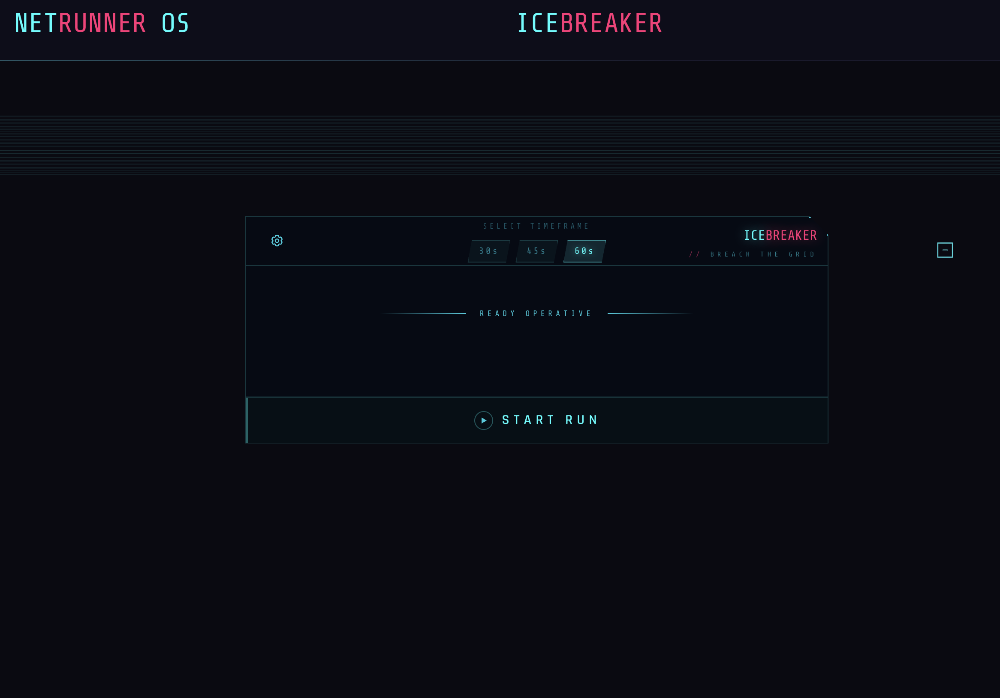
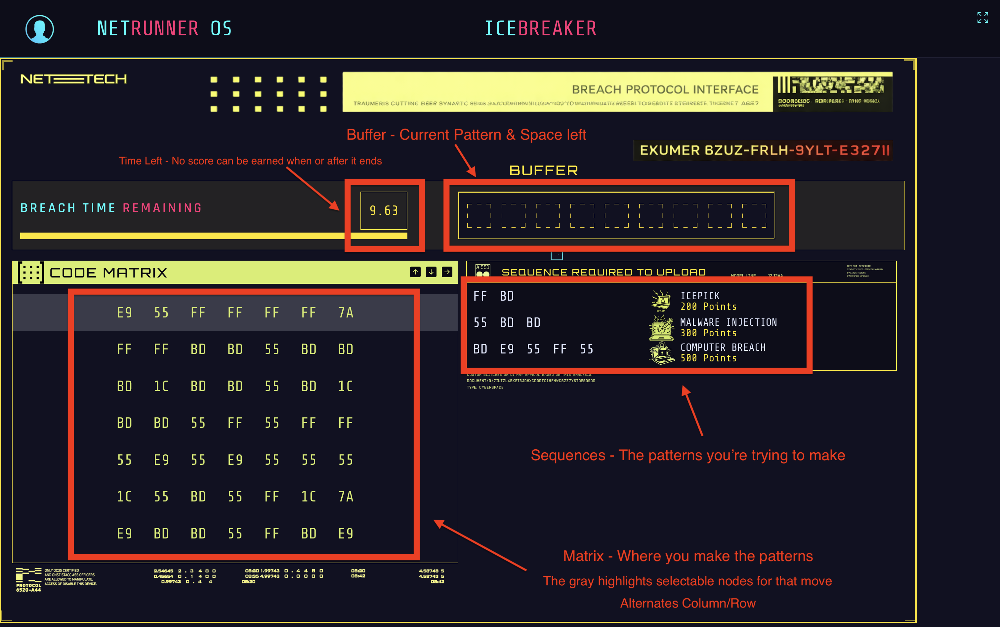
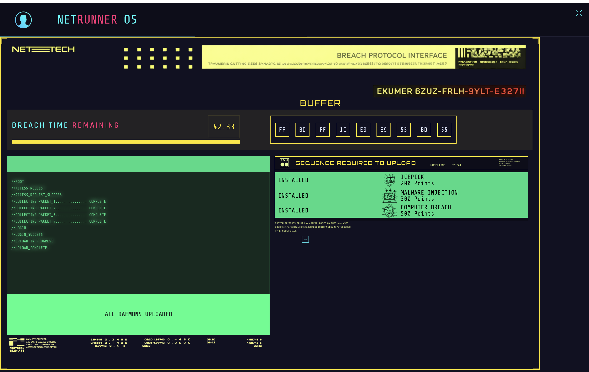
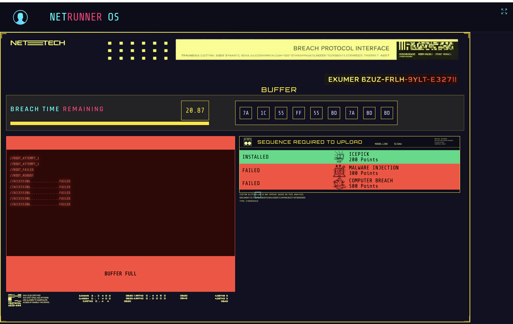
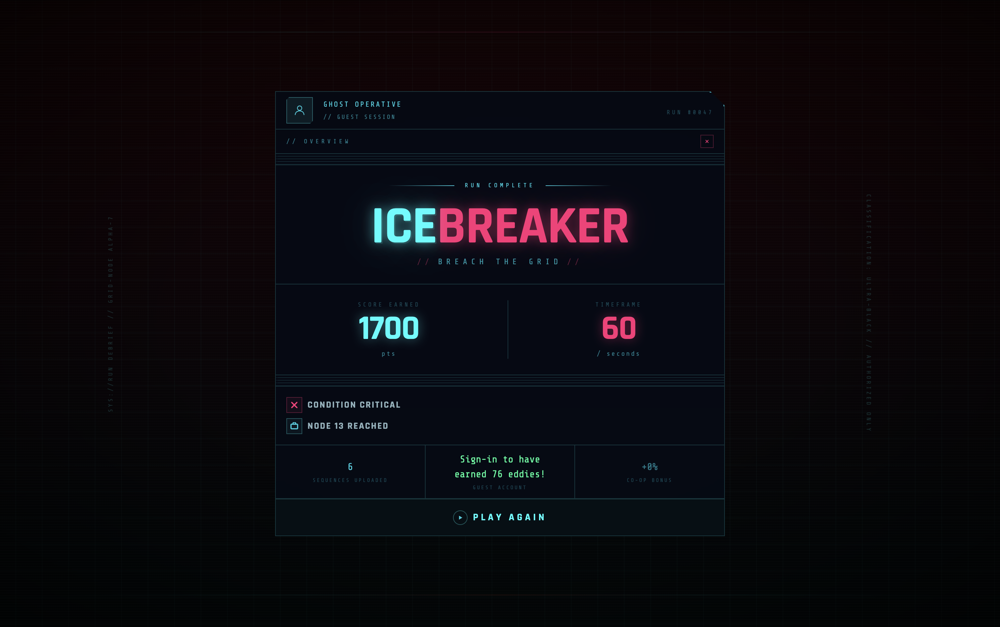
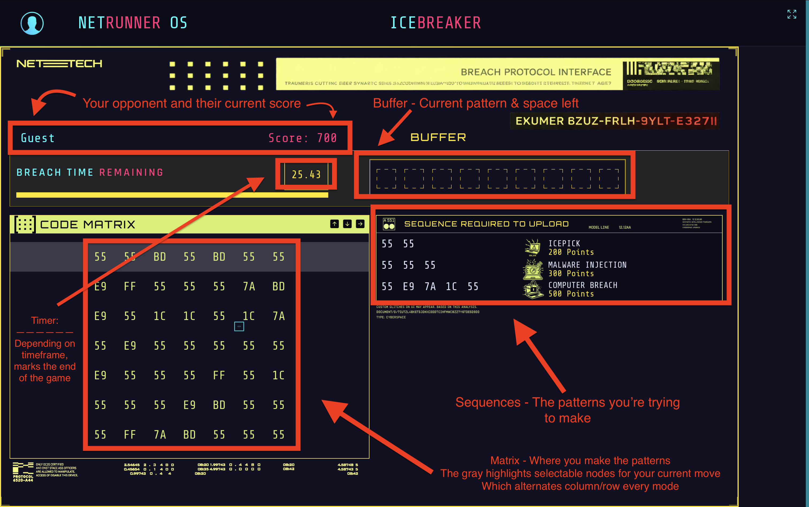
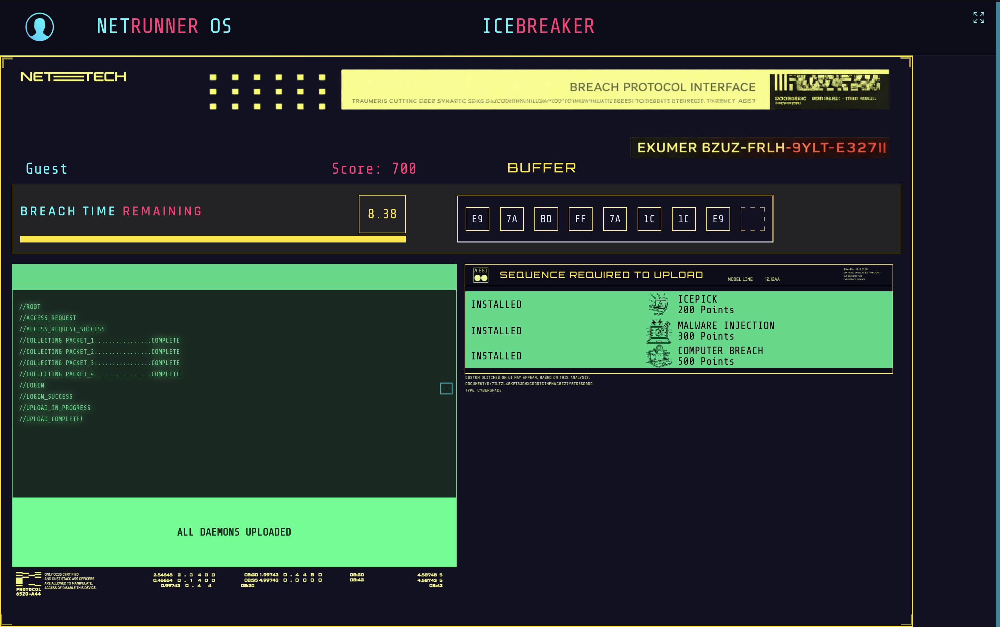
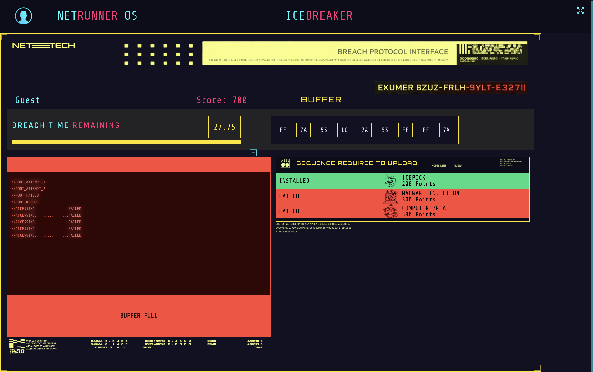
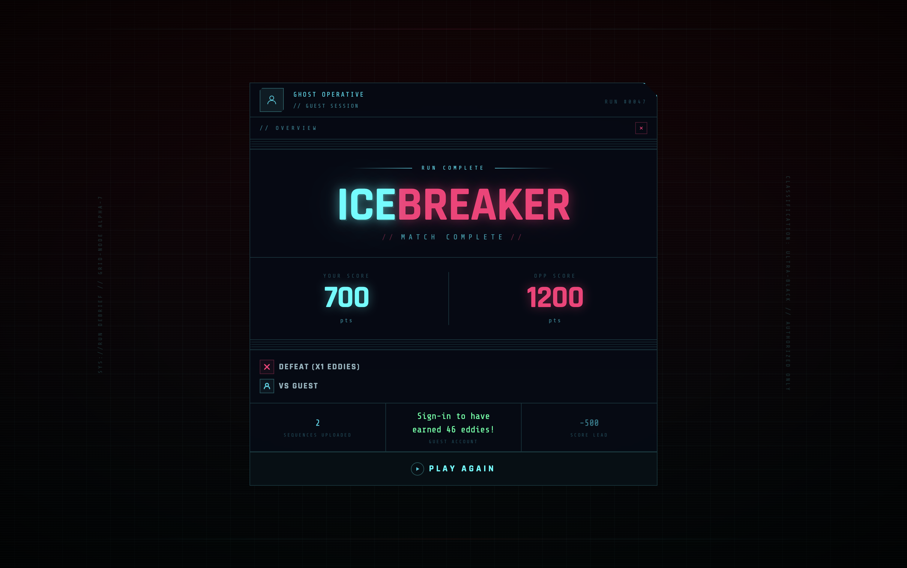
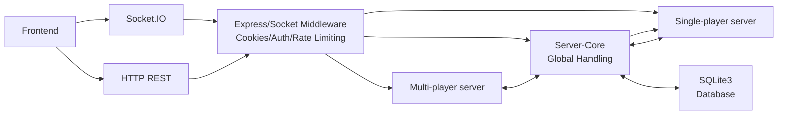

<div align="center">

# 

#### Repo Details


&emsp;&emsp;&emsp;&emsp;


---

#### Familiar Tech Stack


---

#### Additions to Tech Stack


</div>

---

# Table of Contents

- [Introduction](#introduction)
- [Game Tutorial](#game-tutorial)
  - └─ [Single Player](#single-player)
  - └─ [Multi Player](#multi-player)
- [Usage/Installation](#usage)
  - └─ [Usage](#usage)
  - └─ [Installation](#first-time-installation)
- [Architecture/Routes](#architecture)
  - └─ [Architecture](#architecture)
  - └─ [Routes](#routes)
- [Features/Mechanics](#features)
- [Planned Features (not yet active)](#planned-features-not-yet-active)

---

# Introduction

**ICEBreaker** is a cyberpunk hacking simulation game that brings the tension of digital infiltration to the browser. Inspired by *Cyberpunk 2077's* Breach Protocol, players take on the role of a system intruder navigating encrypted networks, decoding hexadecimal matrices, and deploying powerful daemon sequences while racing against an unforgiving countdown.

Every breach is a strategic puzzle: analyze the grid, predict the optimal path, chain together valuable exploits, and push the system as far as possible before security locks you out. With a neon terminal aesthetic, immersive cyberpunk atmosphere, and fast-paced decision-making, ICEBreaker turns the process of "hacking" into a high-pressure tactical experience.

Behind the interface is a full-stack architecture built for reliability and scale, featuring real-time communication, custom authentication, persistent user data, and server-authoritative validation. ICEBreaker combines the creativity of a cyberpunk game with the engineering principles of a production-style web application.

---

# Game Tutorial

## Single Player

1. Select a timeframe:
   - This is how long you have to play, longer is easier, shorter is harder
   - Options are 30 / 45 / 60 seconds, with 60 being the default
2. After starting the game:
   - There are 3 main parts of the game for you to keep in mind:
     - Matrix
     - Sequences List
     - Buffer
   - The matrix - an array of nodes that you can move around either one row or one column at a time, your goal with this matrix is to plan a route that makes the patterns in the sequences list
   - The sequences list - a list of node patterns that you try to make from the matrix, the nodes you select can be in any order and can overlap, so long as they are in your selected node list in the correct adjacent order
   - Buffer - this is the catch, you can only select a certain amount of nodes per round, the buffer shows you the current nodes you've used and also how many left you can use.
3. How scoring works:
   - Each pattern in the sequence list has a specific difficulty easy/medium/hard, which means shorter to longer lengths.
   - Higher difficulties are worth more length, but are also harder to achieve because of their longer length.
   - At the end of a round, assuming the timer hasn't ended yet, a new one starts with new sequences. These new sequences will add to your achieved score from the last round, until the timer rounds out.
   - You are not given points for a sequence just by installment, they are scored at the end of round, not including the round ending because of the timer running out.
   - Your score directly contributes to the earning of "eddies," the in-game currency, allowing you to upgrade your future runs with customization and perks. (Assuming you are not playing as a guest account)
4. In game screenshots:

<div align="center">

<table style="border-collapse: separate;border-spacing: 0 50px;">
  <tr>
    <td align="center">TimeFrame Selection</td>
    <td></td>
  </tr>
  <tr>
    <td align="center">Labeled Game GUI</td>
    <td></td>
  </tr>
  <tr>
    <td align="center">Game Round Won</td>
    <td></td>
  </tr>
  <tr>
    <td align="center">Game Round Lost</td>
    <td></td>
  </tr>
  <tr>
    <td align="center">Game Results Page</td>
    <td></td>
  </tr>
  <tr>
    <td align="center">How the Matrix works<br><br>Gameplay Example</td>
    <td>
      <video controls width="650" poster="./README-CONTENT/gameplay-vid/matrix-game-thumbnail.png" src="https://github.com/user-attachments/assets/f276e773-7599-471f-bc2f-bf8c08e04b9c"></video>
    </td>
  </tr>
</table>

</div>

## Multi Player

1. Select a timeframe:
   - This is how long you have to play, you will only play with opponents who chose the same timeframe
   - Options are 30 / 45 / 60 seconds, with 60 being the default
2. After starting the game:
   - There are 4 main parts of the game for you to keep in mind:
     - Matrix
     - Sequences List
     - Buffer
     - Opponent Score
   - The matrix - an array of nodes that you can move around either one row or one column at a time, your goal with this matrix is to plan a route that makes the patterns in the sequences list
   - The sequences list - a list of node patterns that you try to make from the matrix, the nodes you select can be in any order and can overlap, so long as they are in your selected node list in the correct adjacent order
   - Buffer - this is the catch, you can only select a certain amount of nodes per round, the buffer shows you the current nodes you've used and also how many left you can use.
   - The Opponent will be playing the game at the exact same time as you, their score is continuously updated on your end to know if you are behind or ahead.
3. How scoring works: (Same as singlePlayer for the most part, except there is a bonus at the end depending on who won)
   - Each pattern in the sequence list has a specific difficulty easy/medium/hard, which means shorter to longer lengths.
   - Higher difficulties are worth more length, but are also harder to achieve because of their longer length.
   - At the end of a round, assuming the timer hasn't ended yet, a new one starts with new sequences. These new sequences will add to your achieved score from the last round, until the timer rounds out.
   - You are not given points for a sequence just by installment, they are scored at the end of round, not including the round ending because of the timer running out.
   - Your score directly contributes to the earning of "eddies," the in-game currency, allowing you to upgrade your future runs with customization and perks. (Assuming you are not playing as a guest account)
   - Multiplayer Bonus Eddies

     | Win  | Tie  | Lose |
     |------|------|------|
     | +50% | +25% | +0%  |

4. In game screenshots:

<div align="center">

<table>
  <tr>
    <td align="center">TimeFrame Selection</td>
    <td></td>
  </tr>
  <tr>
    <td align="center">Labeled Game GUI</td>
    <td></td>
  </tr>
  <tr>
    <td align="center">Game Round Won</td>
    <td></td>
  </tr>
  <tr>
    <td align="center">Game Round Lost</td>
    <td></td>
  </tr>
  <tr>
    <td align="center">Game Results Page</td>
    <td></td>
  </tr>
  <tr>
    <td align="center">How the Matrix works<br><br>Gameplay Example</td>
    <td>
      <video poster="./README-CONTENT/gameplay-vid/matrix-game-thumbnail.png" controls width="650">
        <source src="https://github.com/user-attachments/assets/f276e773-7599-471f-bc2f-bf8c08e04b9c" type="video/mp4">
        <source src="./README-CONTENT/gameplay-vid/matrix-gameplay-example.mp4" type="video/mp4">
        <source src="./README-CONTENT/gameplay-vid/matrix-gameplay-example.mov" type="video/mov">
        Your browser does not support the video tag.
      </video>
    </td>
  </tr>
</table>

</div>

---

# Usage

### First-Time Installation

#### Environment Dependencies

- Node (required)

#### ([Skip to this step if already Installed](#once-node-is-installed))

#### Install Node

You just need Node installed by whatever method works for you. A few options:

**Option A — Official installer (all platforms, easiest)**
Download and run the installer from [nodejs.org](https://nodejs.org) — it includes npm.

**Option B — Homebrew (macOS/Linux)**

```bash
# 1. Install Homebrew (skip if already installed)
/bin/bash -c "$(curl -fsSL https://raw.githubusercontent.com/Homebrew/install/HEAD/install.sh)"
# Homebrew will print some setup commands tailored to your system — run those too

# 2. Install Node
brew install node
```

**Option C — winget (Windows)**

```bash
winget install OpenJS.NodeJS.LTS
```

**Option D — nvm (any platform, lets you manage multiple Node versions)**

```bash
curl -o- https://raw.githubusercontent.com/nvm-sh/nvm/v0.40.5/install.sh | bash
```

Then close and relaunch your terminal window

```bash
nvm install --lts
```

**Important:** Now that you have node installed, reopen your terminal to ensure its loaded in the profile

Verify it worked (In new terminal window):

```bash
node -v
npm -v
```

#### Once Node is installed:

```bash
git clone https://github.com/Crown-Matrix/ICEbreaker.git

cd ICEbreaker

npm install
```

### Method 1: Localhost

1. Ensure project root directory is named either 'src' or 'icebreaker' (case-insensitive)
2. choose port to host on in .env, default is 3000
3. run `npm run main`
   ##### This will do the following things:
   - Initialize database folder if necessary
   - Initialize .env file if necessary
   - import .env variables to process
   - if in TEST_MODE a REPL terminal will pop up, will not work in general prod deployment
   - runs single player server on provided localhost:port
   - runs multi player server on the same provided localhost:port
4. open process on [localhost:port](localhost:port)

### Method 2: Deployment

1. Ensure project root directory is named either 'src' or 'icebreaker' (case-insensitive)
2. Ensure port is allowed by deployment service rules
3. run `npm run main`
   ##### This will do the following things:
   - Initialize database folder if necessary
   - Initialize .env file if necessary
   - imports .env to process
   - Runs both single/multiplayer player server on provided deployed origin

## Environment Variable Usage

1. `ICEBREAKER_PORT` = POSITIVE INTEGER
   - Sets port to host icebreaker endpoints
2. `AUTO_KILL_PREVIOUS_PROCESS` = "true"/"false"
   - Whether or not `npm run main` should kill previous processes or not, disable if you want to run multiple instances
3. `MAC_TAB` = "true"/"false"
   - For macOS only, hosts the terminal instance on terminal app rather than the native IDE
4. `ADMIN_OPEN` = "true"/"false"
   - Auto opens the admin-panel after `npm run main`
5. `TEST_MODE` = "true"/"false"
   - Enables/Disables (respectively) the REPL admin console
6. `MAC_TAB_USE_EXEC` = "true"/"false"
   - Disables/Enables (respectively) the usage of a subshell for the node process running the server
7. `DISABLE_RATE_LIMIT` = "true"/"false"
   - Whether or not to disable the rate limiting (for testing purposes)
8. `PROXY_HOP_AMOUNT` = POSITIVE INTEGER
   - Express configuration for how many proxy hops to allow, must be set to exactly how many proxys are being used
9. `USE_TURSO_DATABASE` = "true"/"false"
   - Whether to use Turso (libSQL cloud) or local SQLite as the database backend
10. `LAST_SQL_MODE` = "true"/"false"/"undefined"
    - Tracks which SQL mode was active on the last run; managed automatically — do not set manually
11. `TURSO_DATABASE_URL` = URL
    - Turso database URL; required when USE_TURSO_DATABASE is true
12. `TURSO_AUTH_TOKEN` = TOKEN
    - Turso authentication token; required when USE_TURSO_DATABASE is true

---

# Architecture


```mermaid
graph LR

A[Frontend] --> B[Socket.IO]
B --> C[Express/Socket Middleware\nCookies/Auth/Rate Limiting]
A --> Z[HTTP REST]
Z --> C
C --> D[Server-Core\nGlobal Handling]
C --> E[Single-player server]
E <--> D
C --> F[Multi-player server]
F <--> D
D --> E
D <--> G[SQLite3\nDatabase]
```

Original Overview - [ICEBreaker-Architecture](https://github.com/crown-matrix/ICEbreaker/blob/main/personal/ICEBreaker_Architecture.png)

## Routes

| Method | Path | Description |
|---|---|---|
| `GET` | `/` | Serves the game cover page |
| `GET` | `/singlePlayer` | Reference/lobby page |
| `GET` | `/singlePlayer/result` | Post-game results |
| `GET` | `/multiPlayer/` | Reference/lobby page |
| `GET` | `/multiPlayer/result` | Post-game comparison results |
| `GET` | `/log-in` | Login page |
| `GET` | `/sign-up` | Sign-up page |
| `GET` | `/log-out` | Logout page |
| `GET` | `/auth/checkForUsername/:u` | `{ available: bool }` for username availability |
| `POST` | `/log-in` | Login handler |
| `POST` | `/sign-up` | Registration handler |
| `POST` | `/log-out` | Logout + clear cookie |
| `GET` | `/profile` | View your signed-in account |
| `GET` | `/profile/api/user/:username` | Public profile data lookup |
| `GET` | `/profile/api/friends` | Fetch your friends list |
| `POST` | `/profile/api/friends/request` | Send a friend request |
| `POST` | `/profile/api/friends/accept` | Accept a friend request |
| `POST` | `/profile/api/friends/decline` | Decline a friend request |
| `POST` | `/profile/api/friends/cancel` | Cancel an outgoing friend request |
| `POST` | `/profile/api/friends/remove` | Remove a friend |
| `GET` | `/banned` | Ban notice page |
| `GET` | `/admin-panel` | admin-panel html page |
| `GET` | `/admin-panel/api` | admin-panel api endpoint, takes subendpoints for specific desired data |
| `GET` | `/admin-panel/api/[singlePlayer,multiPlayer,all(default)]/[os,analytics,all(default)]` | subendpoint key |

### Alias System

In `private/Server-Imports/General/path_alias.json`, multiple paths have been aliased, allowing a user to request a synonym of an endpoint and be redirected (with permanent status 308) to the correct endpoint.

---

# Features

### Runtime & Server

| Layer | Technology | Details |
|---|---|---|
| Runtime | Node.js | CJS + ESM hybrid (`"type": "module"`, server files use `.cjs`) |
| HTTP Framework | Express 5 | Static serving, REST auth routes, JSON middleware |
| Real-time | Socket.IO v4 | WebSocket game loop; custom path `/singlePlayer/socket` |
| Entry Point | `main.cjs` | Bootstraps servers, creates `/database/` dir, opens REPL console |

### Authentication

| Layer | Technology | Details |
|---|---|---|
| Session tokens | `crypto.randomUUID` + `crypto.hash('sha512')` | Opaque 128-char hex token |
| Password hashing | bcrypt | 12 salt rounds |
| Cookie transport | `cookie-parser` | httpOnly, Secure, SameSite=Strict |
| Session lifetime | SQLite `sessions` table | 7-day expiry, validated automatically on each request |
| HTTP security/performance headers | CSP_directives(allowed file sources),frameGuard, etc | Basic-moderate XSS protection |

### Caching & Indexing

Server-controlled cache/index rules (configured in private/admin-js/server-core.cjs):

- X-Robots-Tag (noindex): sets `X-Robots-Tag: noindex, nofollow` for paths where crawlers should not index pages:
  - `/admin-panel`
  - `/banned`
  - `/auth/banned`
  - `/singlePlayer/result`
  - `/multiPlayer/result`
  - `/auth/checkForUsername`
  - `/profile`

- Cache-Control: `no-store` — responses must not be stored by browsers or intermediate caches (sensitive data):
  - `/profile`
  - `/admin-panel`
  - `/auth/checkForUsername`

- Cache-Control: `no-cache` — responses should be validated before reuse (freshness required):
  - `/singlePlayer/result`
  - `/multiPlayer/result`
  - `/banned`
  - `/auth/banned`
  - `/js`, `/css`, `/imgs` (static assets — set directly on their static middleware, not through the path-list mechanism above)


### Database

| Layer | Technology | Details |
|---|---|---|
| Engine | SQLite / Turso (libSQL) | Local: `private/database/ICEbreaker.db`; Cloud: Turso replica sync |
| Bindings | `better-sqlite3` / `libsql` | Synchronous local API; async cloud API; mode set via `USE_TURSO_DATABASE` |
| Config | WAL journal mode & Foreign constraints | `PRAGMA journal_mode = WAL; PRAGMA foreign_keys = ON` |
| Schema | 6 tables | `users`, `sessions`, `friends`, `banned`, `challenges`, `direct_matches` |

### Frontend

| Layer | Technology | Details |
|---|---|---|
| Markup | Vanilla HTML5 | No SSR; Express serves static files |
| Styling | Bootstrap 5.3 + custom CSS | `vibe-cyberpunk.css` — full cyberpunk design system |
| JS | Vanilla ESM | `SinglePlayerFrontend` class (~1802 lines); no framework |
| JS | Vanilla ESM | `multiPlayerFrontend` class (~1971 lines); no framework |
| Navigation | Custom SPA | `goToPage()` fetches HTML, replaces `<head>`/`<body>`, re-runs scripts; state via `sessionStorage` |
| Game logic | `codeMatrix.js` | Matrix generation, solution injection, buffer checking |
| Audio | `audio.js` | Sound effects and background music management |

### Game Mechanics

| Concept | Value | Notes |
|---|---|---|
| Matrix size | 7 × 7 | Fixed |
| Node symbols | `7A 1C BD 55 E9 FF` | 6 possible values |
| Max buffer | 9 cells | Server-enforced |
| Difficulties | Easy / Medium / Hard | 200 / 300 / 500 points |
| Eddies formula | `((3 × score) / 100) + 25` | |
| Time options | 30 / 45 / 60 s | Changeable before round start only, final decision is server-stored |
| Anti-cheat | Server-side validation | Immutable keys; tampering = auto-ban |

### Dev Tooling

| Tool | Details |
|---|---|
| Shell scripts | `personal/shell/` — startup, DB init, env init, kill, filemap, etc. |
| macOS integration | `main.sh` opens a new Terminal tab for the admin REPL; auto-opens admin panel; configurable in .env |
| Admin REPL | `readline`-based eval console in `main.cjs` with live access to `db`, `sql`, `auth` |
| Environment | `.env` file — see [Environment Variable Usage](#environment-variable-usage) for all supported variables |
| TEST_MODE | `disables auth ; unlocks applicable parts of the application for testing purposes` |
| DISABLE_RATE_LIMIT | `Disables all rate limiting ; for testing purposes` |
| verify-csp-hashes.cjs | `Prints out the sha-384 of inline scripts of a given file for file integrity implementation` |

---

# Planned Features (not yet active)

- **Admin Panel** - route & api structure initialized - awaiting full frontend implementation
- **Account tiers** — VIP (emotes, costs eddies or IRL money), PREMIUM (emotes + animation skips + opponent distractions, IRL money only), ADMIN (full access to everything including admin endpoints, not regular-user obtainable)


### Disclaimer

- AI was used in this project as an assistant, not as a developer.
- Nothing was written that I didn't explicitly ask and write the backend for
